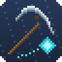

# ShaftUtils

Glacite Mineshaft helpers for Hypixel SkyBlock: find Frozen Corpses faster and follow mining routes.

## Installing
1. Install [Fabric Loader](https://fabricmc.net/use/) 0.19.5+ and [Fabric API](https://modrinth.com/mod/fabric-api).
2. Download the jar for your Minecraft version (`+mc26.1` or `+mc26.2`) from
   [Releases](https://github.com/DeveloperGr3y/ShaftUtils/releases) and drop it in your `mods` folder. Needs Java 25.
3. In game, `/shaftutils` opens the settings and `/shaftutils gui` moves the status panel.

## Corpse finder
- Entering a shaft puts a waypoint on every known spot a corpse can spawn in that shaft type. It ships with the spots
  we've seen corpses at ourselves (26 so far, across 9 shaft types, more each release), and learns more as you play:
  every corpse you see that isn't known yet is saved as a spot for that shaft type (Debug > Record New Spots).
- A spot clears once you've looked at it (on screen, with a clear line to it). If a corpse is there it becomes a
  corpse waypoint with its type, distance and whether you have the key it needs.
- Corpses are only marked once you can see them. Nothing is shown through walls.
- When you've found as many corpses as the tab list says the shaft has, the rest of the spots clear.

### With the Organ Donor talisman
The talisman's ding gets higher as you get closer: its pitch gives your distance to the corpse it's following
(distance ≈ 20 × √(2 − pitch), about half a block out on average). ShaftUtils turns that into:
- the distance and a direction arrow in the status panel;
- a green **likely corpse** marker on the spawn spot the dings point to;
- clearing spots when it's been silent where you're standing (no unlooted corpse within 20 blocks);
- an estimated position when no known spot fits.

## Routes
Ordered mining routes, loaded automatically when you enter a shaft.
- **Built in:** routes from the **Mining Cult** community. Turn them off with Routes > Use Built-in Routes.
- **Your own:** copy a route and run `/shaftutils route import` in the shaft (or `/shaftutils route import TOPA_1`
  from anywhere). Yours replace the built-in one for that shaft. Files live in `config/shaftutils/routes/`, one per
  shaft code (`TOPA_1.json`, `RUBY_C.json`, ...); `CRYSTAL.json` covers crystal shafts without their own file.
- Formats: the common `[{"x":..,"y":..,"z":..,"r":..,"g":..,"b":..,"options":{"name":"1"}}]` list, plain
  `[{"x":..,"y":..,"z":..}]` / `[[x,y,z]]`, or text with one `x y z` (or `x,y,z`) per line.
- Shows the current point as an outlined block with its number and distance, a line from your crosshair to it, and the
  next couple of points dimmer. Moves on when you're within 3 blocks; you can also set next/previous keys.

## Commands
| Command | |
|---|---|
| `/shaftutils` | Settings |
| `/shaftutils gui` | Move and resize the status panel |
| `/shaftutils status` | Shaft code, tab corpses, spot counts |
| `/shaftutils route` | Route status and list |
| `/shaftutils route import [code]` | Save the route on your clipboard for this shaft (or a named one) |
| `/shaftutils route next` / `back` / `restart` | Step through the route |
| `/shaftutils route reload` / `delete [code]` / `folder` | Manage your route files |
| `/shaftutils addspot` / `export` / `probe` | Debug: record a spot, export spots, find the probe logs |

## Heads up
I wrote this with a lot of help from AI (Claude). I use it myself, but nobody else has reviewed it yet, so read the
source if that matters to you.

It only reads chat, the tab list, the scoreboard, sounds and what's on screen. It never mines, clicks or moves for you,
and it doesn't show anything through walls.

## Credits
- Built-in routes by the **Mining Cult** community, used with their permission (not covered by the CC0 licence).
- Licence: CC0 for ShaftUtils' own code. Third-party parts are listed in [THIRD_PARTY_NOTICES.md](THIRD_PARTY_NOTICES.md).

## Debug / data gathering
In the Debug tab:
- **Probe Logging** (off by default) writes dings, positions, corpse sightings and shaft info to `config/shaftutils/probe/<date>.jsonl`.
- **Record New Spots** (on by default) saves corpses seen away from a known spot to `config/shaftutils/learned_spawns.json`.
- `/shaftutils export` merges known + learned spots into `config/shaftutils/corpse_spawns.export.json`.

## Building
`./gradlew build` (JDK 25). Jars end up in `build/libs/`.

`./gradlew build -Ppersonal` also bundles anything in a local, git-ignored `personal/` folder (e.g. extra spawn data in
`assets/shaftutils/corpse_spawns_personal.json`) and names the jars `...-personal.jar`.

To add spots for a release: run `/shaftutils export` and copy `config/shaftutils/corpse_spawns.export.json` over
`src/main/resources/assets/shaftutils/corpse_spawns.json` (it only includes our own data, never the personal file).

## Contributing
Open a PR against `main` with a [Conventional Commit](https://www.conventionalcommits.org/) title, e.g.
`feat: add a route for TOPA_2` or `fix: corpse spot cleared too early`. `feat` bumps the minor version, `fix` the
patch. PRs are squash-merged, and [release-please](https://github.com/googleapis/release-please) turns them into a
release PR with the changelog; merging that publishes the release with the jars attached.
